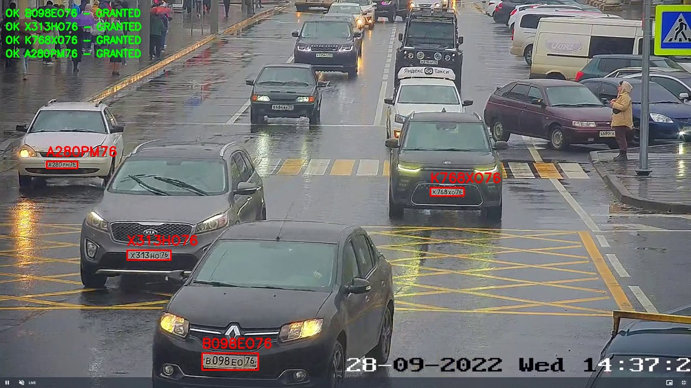

# Residential Parking LPR Access Control

End-to-end license plate recognition system for residential parking access
control.



The original version was my parking access-control project for a real
residential property-management scenario. This public repository is a cleaned,
reproducible version of the same system idea: it uses demo videos, SQLite, and a
simulated controller so the full pipeline can be reviewed without access to the
original cameras, database, or ESP32 hardware.

The system reads a video stream, detects license plates, recognizes the plate
text, checks it against a whitelist, writes an access log, and sends an
open-barrier command through a controller interface.

## Engineering Highlights

- End-to-end computer vision pipeline, not a standalone model script.
- Practical ML engineering around imperfect real-world video: detector choice,
  OCR cleanup, duplicate suppression, and deterministic access decisions.
- Support for both legacy YOLOv5 checkpoints and newer Ultralytics YOLO weights.
- Local SQLite persistence for whitelist and access-log data.
- Hardware boundary kept behind a controller interface: simulated by default,
  serial-ready for ESP32.
- Fast unit tests plus a one-command end-to-end demo.

## System Flow

```text
video / RTSP / webcam
  -> YOLO license plate detector
  -> LPRNet OCR
  -> text normalization
  -> SQLite whitelist lookup
  -> access_log insert
  -> simulated or serial barrier command
```

## Quick Start

```bash
pip install -r requirements.txt
python demo/run_demo.py
```

The demo processes `data/videos/demo.mp4`, creates `data/access_list.db`, and
writes an annotated video:

```text
data/videos/demo_output.mp4
```

The console output shows processed frames, recognized plates, granted/denied
access decisions, and the number of access-log rows added.

Example output:

```text
Demo result
============================================================
Video:              data/videos/demo.mp4
Frames written:     360
Frames analyzed:    12
Process every:      30 frame(s)
Output duration:    6.0s
Plate detections:   26
Access granted:     A280PM76, B098EO76, H386CE76, K768XO76, O718CY777, X313HO76
DB log rows added:  13
Status:             PASS
```

By default the demo writes six seconds of video and runs detection/OCR every 30
frames. For a full per-frame pass:

```bash
python demo/run_demo.py --seconds 0 --process-every 1
```

## Manual Run

Create the local whitelist:

```bash
python demo/setup_whitelist.py
```

Run the default demo:

```bash
python main.py
```

Run a specific video without opening a display window:

```bash
python main.py video data/videos/rfpass.mp4 --no-display
```

Save an annotated video:

```bash
python main.py video data/videos/rfpass.mp4 --output data/videos/output.mp4 --no-display
```

Run with the alternative YOLOv8 detector:

```bash
python main.py --config configs/config.yolov8.yaml video data/videos/demo.mp4 --no-display
```

The default config uses `data/weights/skud.pt`, a YOLOv5 plate detector that
works well on the included residential-parking videos. The detector wrapper also
supports Ultralytics YOLO weights through `configs/config.yolov8.yaml`.

## Repository Layout

```text
main.py                         application entry point
configs/config.yaml             default config, YOLOv5 skud.pt
configs/config.yolov8.yaml      alternative config, Ultralytics YOLO
src/detector/                   YOLOv5/Ultralytics detector wrapper
src/ocr/                        LPRNet plate OCR
src/pipeline/                   detection -> OCR -> database -> controller
src/database/                   SQLite/JSON access database
src/controller/                 simulated or serial barrier controller
demo/setup_whitelist.py         creates the allowed plate list
demo/run_demo.py                one-command end-to-end check
demo/test_yolov5_weights.py     optional YOLOv5 weight comparison
docs/ARCHITECTURE.md            design notes and pipeline diagram
docs/TESTING.md                 fast checks and end-to-end test notes
docs/MODELS.md                  model choices and limitations
```

## Included Assets

Only the files needed to run the demo are kept in git:

```text
data/videos/demo.mp4
data/videos/rfpass.mp4
data/weights/skud.pt
data/weights/yolo8s.pt
data/weights/LPRNet.pth
```

Generated databases, logs, comparison images, caches, and output videos are
ignored by git.

## Public Demo vs Original Deployment

The original project target included real cameras, a persistent access database,
and ESP32-controlled barrier hardware. This repository keeps the same software
boundaries but replaces site-specific infrastructure with local components:

- camera input -> included MP4 files;
- database -> local SQLite;
- ESP32 barrier -> simulated controller;
- site-specific configuration -> reproducible YAML configs.

## Database

The default database path is:

```text
data/access_list.db
```

It is created automatically. The database contains:

- `whitelist`: allowed plate numbers;
- `access_log`: every access attempt with timestamp and decision.

The whitelist used by the demo is defined in `demo/setup_whitelist.py`.

## Testing

Fast checks that do not load model weights:

```bash
python -m unittest discover
```

End-to-end check:

```bash
python demo/run_demo.py
```

More detail is in `docs/TESTING.md`.

## Controller

The default controller is simulated:

```yaml
controller:
  type: "simulated"
```

For an ESP32 connected over serial, switch the controller in the config:

```yaml
controller:
  type: "serial"
  serial_port: "COM3"
  baud_rate: 115200
```

The serial controller sends:

```text
OPEN_BARRIER
CLOSE_BARRIER
```

## Notes

The current demo is plate-first: it detects the plate directly and does not need
a separate vehicle detector. OCR can vary between neighboring frames, so the
pipeline maps one-character OCR variants to known whitelist plates before the
database lookup.
