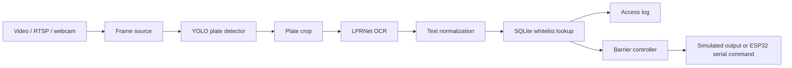

# Architecture

The project keeps the original residential parking access-control idea, but
replaces site-specific hardware with local assets so the full flow can be
reviewed on a laptop.

## Runtime Flow

1. `main.py` loads a YAML config and initializes the detector, OCR model,
   database, controller, and pipeline.
2. `src/pipeline/lpr_pipeline.py` receives each frame, detects license plates,
   crops the plate region, runs OCR, normalizes the result, and checks access.
3. `src/database/access_db.py` stores authorized plates and writes every access
   attempt to `access_log`.
4. `src/controller/barrier_controller.py` either simulates a barrier command or
   sends `OPEN_BARRIER` / `CLOSE_BARRIER` over serial.

## Model Modes

The detector wrapper supports two checkpoint formats behind one interface:

- `configs/config.yaml`: YOLOv5 checkpoint, `data/weights/skud.pt`
- `configs/config.yolov8.yaml`: Ultralytics YOLO checkpoint,
  `data/weights/yolo8s.pt`

Both backends return the same `Detection` objects, so the rest of the code does
not need to know which model produced the plate box.

## Demo Mode

`demo/run_demo.py` is the fastest way to verify the system end to end. It:

- creates a deterministic whitelist;
- processes a short section of `data/videos/demo.mp4`;
- writes `data/videos/demo_output.mp4`;
- prints granted/denied decisions;
- returns exit code `0` only when at least one authorized plate is detected and
  the annotated output video is created.

## What Is Simulated

The original project target was a residential parking setup with cameras, an
access database, and an ESP32 barrier controller. In this repository:

- the camera is replaced by included MP4 files;
- the database is local SQLite;
- the ESP32 is replaced by `SimulatedBarrierController`.

The serial controller remains in the code path, so the same pipeline can be
connected to hardware by changing the controller config.
